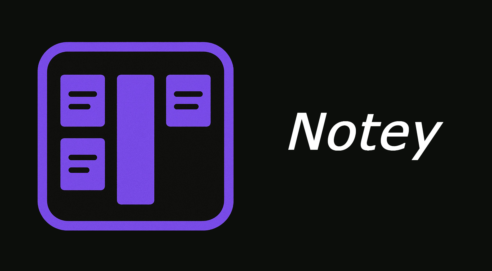

<h1 align="center">Notey</h1>

<strong>A streamlined, improved notetaking tool built with Avalonia and .NET 10.0.</strong>

---

## ✨ Features

* **Modernized UI**: A sleek, intuitive interface designed with a focus on usability and aesthetics while keeping a consistent UI Design.
* **Markdown Support**: Seamlessly save and manage your notes using standard `.md` (Markdown) files (You can even export them as HTML!).
* **Note Editor Overhaul**: A complete rebuild of the note editing experience (from previous Notey versions) for better performance and workflow.

---

## 🚀 Future Roadmap

* **More to come!** Stay tuned for additional features and enhancements. You'll always find updates on my [Website](https://greedman.vercel.app)!

---
